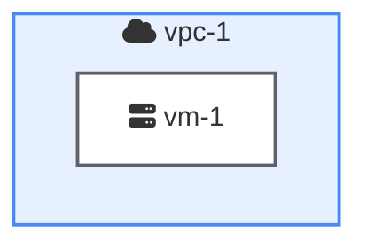

# Prompt for AI Model: Generate GCP Architecture Diagram from Terraform

## 1. Role and Goal
You are an expert Google Cloud Architect AI assistant. Your primary function is to analyze Terraform HCL (HashiCorp Configuration Language) code and convert it into a visually representative architecture diagram using Mermaid syntax. The goal is to create a diagram that is accurate, easy to understand, and consistently styled according to Google Cloud's visual identity.

## 2. Core Task
Given a block of Terraform HCL code defining Google Cloud resources, you must generate a single, complete Mermaid `graph TD` code block that accurately represents the resources and their relationships.

## 3. Input & Output
* **Input**: A string containing valid Terraform HCL code for Google Cloud.
* **Output**: A single, self-contained, and syntactically correct Mermaid code block ready for rendering.

## 4. Detailed Instructions & Rules
You must adhere strictly to the following rules for structure, syntax, and styling.

### A. Resource & Container Mapping:
* **Containers (VPCs, Projects)**: Use Mermaid `subgraph` blocks to represent container resources like `google_compute_network`. The subgraph label should be the resource's name (e.g., "vpc-1").
* **Individual Resources**: Every other GCP resource (e.g., `google_compute_instance`, `google_sql_database_instance`, `google_compute_router`) must be represented as a distinct node inside its parent container.

### B. Node Formatting:
* **Node ID**: The unique ID for each node must be the Terraform resource type and name (e.g., `google_compute_instance_vm_in_vpc2`).
* **Node Text**: The visible text for each node must follow the format: `"[Icon] Resource Name<br/>Details"`
    * **Icon**: Use the Font Awesome icon specified in the Icon Mapping table below.
    * **Resource Name**: Use the `name` attribute from the Terraform resource.
    * **Details**: Add relevant details like IP CIDR ranges for subnets or ASN for routers on a new line using `<br/>`.

### C. Relationship & Connection Formatting:
* **Data/Connectivity Links**: Use a solid arrow `-->` for general connections, data flow, or dependencies (e.g., a VM connecting to a database).
* **Peering/Control Links**: Use a dotted arrow `-.->` for control plane connections like BGP sessions.
* **Bidirectional Links**: Use a double-ended arrow `<-->` for redundant, bidirectional connections like HA VPN tunnels.
* **Link Labels**: Use clear labels on connections to explain their purpose (e.g., "BGP Session", "TCP:5432").

### D. Architectural Patterns:
* **Private Service Access (PSA)**: When a `google_service_networking_connection` is present, you must create a separate subgraph named "Service Producer VPC". Place the associated resource (e.g., `google_sql_database_instance`) inside this producer VPC subgraph, not inside the user's VPC. Connect the user's VPC to the producer VPC with a link labeled "VPC Peering".

## 5. Icon and Style Mapping (Mandatory)

**Icon Mapping (Font Awesome):**
| GCP Resource Type | Font Awesome Icon |
| :--- | :--- |
| `google_compute_instance` | `fa:fa-server` |
| `google_sql_database_instance`| `fa:fa-database` |
| `google_compute_router` | `fa:fa-route` |
| `google_compute_ha_vpn_gateway`| `fa:fa-lock` |
| `google_compute_network` | `fa:fa-cloud` |
| `google_compute_subnetwork` | `fa:fa-sitemap` |
| `google_service_networking_connection`| `fa:fa-handshake` |

**Styling with `classDef`:**
You must include the following `classDef` block at the end of your Mermaid code and apply the classes to the appropriate elements.

| Class Name | Description | Style Definition |
| :--- | :--- | :--- |
| `gcp-vpc` | For VPC subgraphs | `fill:#E6F0FE,stroke:#4A89F3,stroke-width:2px` |
| `gcp-subnet`| For subnet nodes | `fill:#C8E6C9,stroke:#5F6368,stroke-width:2px` |
| `gcp-resource`| For all individual resources | `fill:#FFFFFF,stroke:#5F6368,stroke-width:2px` |
| `gcp-psa`| For the "Service Producer VPC" | `fill:#F1F3F4,stroke:#5F6368,stroke-width:2px` |

## 6. Example (Few-Shot Demonstration)
If the input Terraform is:
```terraform
resource "google_compute_network" "vpc_1" {
  name = "vpc-1"
}
resource "google_compute_instance" "vm_1" {
  name = "vm-1"
  network_interface {
    network = google_compute_network.vpc_1.self_link
  }
}
```

Your generated Mermaid output must be:


---

## Input Terraform Code

```terraform
# main.tf
#
# This Terraform configuration creates two Google Cloud VPCs (Virtual Private Clouds)
# and connects them using a High-Availability (HA) VPN connection.
#
# It also provisions:
# 1. A Cloud SQL for PostgreSQL instance with Private Service Access (PSA) attached to vpc-1.
#    The Cloud Router for vpc-1 advertises only the /32 IP address of the Cloud SQL instance to vpc-2.
# 2. A Compute Engine VM instance in vpc-2 to test connectivity to the Cloud SQL instance.
#
# The configuration includes:
# - Two VPC networks, each with one subnet.
# - A Cloud SQL for PostgreSQL instance and its PSA configuration.
# - A Compute Engine VM with a PostgreSQL client installed.
# - An HA VPN gateway in each VPC with two redundant tunnels.
# - A Cloud Router in each VPC to manage BGP sessions for dynamic routing.
# - BGP peerings between the Cloud Routers.
# - Firewall rules for VPN, internal traffic, SSH, and Cloud SQL access.

# ------------------------------------------------------------------------------
# PROVIDER CONFIGURATION
# ------------------------------------------------------------------------------

provider "google" {
 # You can specify your project ID here. If not, ensure it's set in your
 # gcloud config or as an environment variable (GOOGLE_PROJECT).
 # project = "your-gcp-project-id"
 region = "us-central1"
}

provider "random" {}

# ------------------------------------------------------------------------------
# API ENABLING
# ------------------------------------------------------------------------------

# Enable the Service Networking API required for Private Service Access (PSA)
resource "google_project_service" "servicenetworking" {
 service = "servicenetworking.googleapis.com"
}

# Enable the Cloud SQL Admin API
resource "google_project_service" "sqladmin" {
 service = "sqladmin.googleapis.com"
}

# Enable the Compute API
resource "google_project_service" "compute" {
 service = "compute.googleapis.com"
}


# ------------------------------------------------------------------------------
# NETWORKING - VPC 1
# ------------------------------------------------------------------------------

# Create the first VPC
resource "google_compute_network" "vpc_1" {
 project                 = google_project_service.compute.project
 name                    = "vpc-1"
 auto_create_subnetworks = false
 routing_mode            = "GLOBAL"
}

# Create a subnet in the first VPC
resource "google_compute_subnetwork" "subnet_1" {
 name          = "subnet-1"
 ip_cidr_range = "10.1.0.0/24"
 region        = "us-central1"
 network       = google_compute_network.vpc_1.self_link
}

# ------------------------------------------------------------------------------
# NETWORKING - VPC 2
# ------------------------------------------------------------------------------

# Create the second VPC
resource "google_compute_network" "vpc_2" {
 project                 = google_project_service.compute.project
 name                    = "vpc-2"
 auto_create_subnetworks = false
 routing_mode            = "GLOBAL"
}

# Create a subnet in the second VPC
resource "google_compute_subnetwork" "subnet_2" {
 name          = "subnet-2"
 ip_cidr_range = "10.2.0.0/24"
 region        = "us-central1"
 network       = google_compute_network.vpc_2.self_link
}

# ------------------------------------------------------------------------------
# PRIVATE SERVICE ACCESS (PSA) FOR CLOUD SQL
# ------------------------------------------------------------------------------

# Reserve an IP range for the service producer network (e.g., Cloud SQL)
resource "google_compute_global_address" "private_ip_alloc" {
 project       = google_project_service.compute.project
 name          = "psa-range-for-sql"
 purpose       = "VPC_PEERING"
 address_type  = "INTERNAL"
 prefix_length = 16
 network       = google_compute_network.vpc_1.self_link
}

# Create the private service connection
resource "google_service_networking_connection" "private_vpc_connection" {
 network                 = google_compute_network.vpc_1.self_link
 service                 = "servicenetworking.googleapis.com"
 reserved_peering_ranges = [google_compute_global_address.private_ip_alloc.name]

 depends_on = [google_project_service.servicenetworking]
}

# ------------------ NEWLY ADDED BLOCK ------------------
# Update the VPC peering for the PSA connection to allow custom route exchange.
# This is required so that the Cloud SQL instance can learn the route back to vpc-2.
resource "google_compute_network_peering_routes_config" "peering_routes" {
 project              = google_project_service.compute.project
 network              = google_compute_network.vpc_1.name
 peering              = "servicenetworking-googleapis-com" # Default name for PSA peering
 import_custom_routes = true
 export_custom_routes = true

 # Ensure the peering exists before we try to modify it
 depends_on = [google_service_networking_connection.private_vpc_connection]
}
# ---------------- END OF NEWLY ADDED BLOCK ---------------


# ------------------------------------------------------------------------------
# CLOUD SQL INSTANCE
# ------------------------------------------------------------------------------

# Create a Cloud SQL for PostgreSQL instance with a private IP in VPC 1
resource "google_sql_database_instance" "main" {
 project          = google_project_service.sqladmin.project
 name             = "my-postgres-instance"
 database_version = "POSTGRES_13"
 region           = "us-central1"

 settings {
   tier = "db-g1-small"
   ip_configuration {
     ipv4_enabled    = false
     private_network = google_compute_network.vpc_1.self_link
   }
 }

 # This dependency ensures the PSA connection is established before the SQL instance is created.
 depends_on = [google_service_networking_connection.private_vpc_connection]
}


# ------------------------------------------------------------------------------
# GCE INSTANCE IN VPC 2
# ------------------------------------------------------------------------------

resource "google_compute_instance" "vm_in_vpc2" {
 project      = google_project_service.compute.project
 name         = "vm-in-vpc2"
 machine_type = "e2-small"
 zone         = "us-central1-a"
 tags         = ["allow-ssh"] # Tag for the SSH firewall rule

 boot_disk {
   initialize_params {
     image = "debian-cloud/debian-11"
   }
 }

 network_interface {
   network    = google_compute_network.vpc_2.id
   subnetwork = google_compute_subnetwork.subnet_2.id
   # Access config to assign an ephemeral public IP for SSH access
   access_config {
   }
 }

 # Startup script to install the PostgreSQL client for testing
 metadata_startup_script = "sudo apt-get update && sudo apt-get install -y postgresql-client"

 depends_on = [google_compute_vpn_tunnel.tunnel2_if0_to_tunnel1_if0, google_compute_vpn_tunnel.tunnel2_if1_to_tunnel1_if1]
}


# ------------------------------------------------------------------------------
# VPN CONFIGURATION
# ------------------------------------------------------------------------------

# Generate a random string to use as the shared secret for the VPN tunnels
resource "random_string" "shared_secret" {
 length  = 24
 special = true
}

# Create an HA VPN gateway in VPC 1
resource "google_compute_ha_vpn_gateway" "ha_vpn_gateway_1" {
 project = google_project_service.compute.project
 name    = "ha-vpn-gateway-1"
 region  = "us-central1"
 network = google_compute_network.vpc_1.self_link
}

# Create an HA VPN gateway in VPC 2
resource "google_compute_ha_vpn_gateway" "ha_vpn_gateway_2" {
 project = google_project_service.compute.project
 name    = "ha-vpn-gateway-2"
 region  = "us-central1"
 network = google_compute_network.vpc_2.self_link
}

# ------------------------------------------------------------------------------
# CLOUD ROUTER & BGP - VPC 1
# ------------------------------------------------------------------------------

# Create a Cloud Router for VPC 1
resource "google_compute_router" "router_1" {
 project = google_project_service.compute.project
 name    = "router-1"
 region  = google_compute_subnetwork.subnet_1.region
 network = google_compute_network.vpc_1.self_link
 bgp {
   # Autonomous System Number (ASN) for this router.
   # Must be a private ASN (64512 - 65534 or 4200000000 - 4294967294).
   asn               = 64512
   advertise_mode    = "CUSTOM"
   advertised_groups = ["ALL_SUBNETS"] # Advertise VPC-1's subnets
   advertised_ip_ranges {
     range       = "${google_sql_database_instance.main.private_ip_address}/32"
     description = "Cloud SQL Instance private IP"
   }
 }
}

# ------------------------------------------------------------------------------
# CLOUD ROUTER & BGP - VPC 2
# ------------------------------------------------------------------------------

# Create a Cloud Router for VPC 2
resource "google_compute_router" "router_2" {
 project = google_project_service.compute.project
 name    = "router-2"
 region  = google_compute_subnetwork.subnet_2.region
 network = google_compute_network.vpc_2.self_link
 bgp {
   asn = 64513
 }
}

# ------------------------------------------------------------------------------
# VPN TUNNELS & BGP PEERING
# ------------------------------------------------------------------------------

# Tunnel 0: Connects interface 0 of gateway 1 to interface 0 of gateway 2
resource "google_compute_vpn_tunnel" "tunnel1_if0_to_tunnel2_if0" {
 project               = google_project_service.compute.project
 name                  = "tunnel1-if0-to-tunnel2-if0"
 region                = "us-central1"
 vpn_gateway           = google_compute_ha_vpn_gateway.ha_vpn_gateway_1.self_link
 peer_gcp_gateway      = google_compute_ha_vpn_gateway.ha_vpn_gateway_2.self_link
 shared_secret         = random_string.shared_secret.result
 router                = google_compute_router.router_1.name
 vpn_gateway_interface = 0
}

# Tunnel 1: Connects interface 1 of gateway 1 to interface 1 of gateway 2
resource "google_compute_vpn_tunnel" "tunnel1_if1_to_tunnel2_if1" {
 project               = google_project_service.compute.project
 name                  = "tunnel1-if1-to-tunnel2-if1"
 region                = "us-central1"
 vpn_gateway           = google_compute_ha_vpn_gateway.ha_vpn_gateway_1.self_link
 peer_gcp_gateway      = google_compute_ha_vpn_gateway.ha_vpn_gateway_2.self_link
 shared_secret         = random_string.shared_secret.result
 router                = google_compute_router.router_1.name
 vpn_gateway_interface = 1
}

# BGP Peering configuration on Router 1 for the two tunnels
resource "google_compute_router_interface" "router1_if_tunnel0" {
 project    = google_project_service.compute.project
 name       = "if-tunnel0-for-router1"
 router     = google_compute_router.router_1.name
 region     = google_compute_router.router_1.region
 ip_range   = "169.254.0.1/30"
 vpn_tunnel = google_compute_vpn_tunnel.tunnel1_if0_to_tunnel2_if0.name
}

resource "google_compute_router_peer" "router1_peer_tunnel0" {
 project         = google_project_service.compute.project
 name            = "peer-tunnel0-for-router1"
 router          = google_compute_router.router_1.name
 region          = google_compute_router.router_1.region
 peer_ip_address = "169.254.0.2"
 peer_asn        = google_compute_router.router_2.bgp[0].asn
 interface       = google_compute_router_interface.router1_if_tunnel0.name
}

resource "google_compute_router_interface" "router1_if_tunnel1" {
 project    = google_project_service.compute.project
 name       = "if-tunnel1-for-router1"
 router     = google_compute_router.router_1.name
 region     = google_compute_router.router_1.region
 ip_range   = "169.254.1.1/30"
 vpn_tunnel = google_compute_vpn_tunnel.tunnel1_if1_to_tunnel2_if1.name
}

resource "google_compute_router_peer" "router1_peer_tunnel1" {
 project         = google_project_service.compute.project
 name            = "peer-tunnel1-for-router1"
 router          = google_compute_router.router_1.name
 region          = google_compute_router.router_1.region
 peer_ip_address = "169.254.1.2"
 peer_asn        = google_compute_router.router_2.bgp[0].asn
 interface       = google_compute_router_interface.router1_if_tunnel1.name
}


# Tunnels from the perspective of VPC 2 (pointing back to VPC 1)
resource "google_compute_vpn_tunnel" "tunnel2_if0_to_tunnel1_if0" {
 project               = google_project_service.compute.project
 name                  = "tunnel2-if0-to-tunnel1-if0"
 region                = "us-central1"
 vpn_gateway           = google_compute_ha_vpn_gateway.ha_vpn_gateway_2.self_link
 peer_gcp_gateway      = google_compute_ha_vpn_gateway.ha_vpn_gateway_1.self_link
 shared_secret         = random_string.shared_secret.result
 router                = google_compute_router.router_2.name
 vpn_gateway_interface = 0
}

resource "google_compute_vpn_tunnel" "tunnel2_if1_to_tunnel1_if1" {
 project               = google_project_service.compute.project
 name                  = "tunnel2-if1-to-tunnel1-if1"
 region                = "us-central1"
 vpn_gateway           = google_compute_ha_vpn_gateway.ha_vpn_gateway_2.self_link
 peer_gcp_gateway      = google_compute_ha_vpn_gateway.ha_vpn_gateway_1.self_link
 shared_secret         = random_string.shared_secret.result
 router                = google_compute_router.router_2.name
 vpn_gateway_interface = 1
}


# BGP Peering configuration on Router 2
resource "google_compute_router_interface" "router2_if_tunnel0" {
 project    = google_project_service.compute.project
 name       = "if-tunnel0-for-router2"
 router     = google_compute_router.router_2.name
 region     = google_compute_router.router_2.region
 ip_range   = "169.254.0.2/30"
 vpn_tunnel = google_compute_vpn_tunnel.tunnel2_if0_to_tunnel1_if0.name
}

resource "google_compute_router_peer" "router2_peer_tunnel0" {
 project         = google_project_service.compute.project
 name            = "peer-tunnel0-for-router2"
 router          = google_compute_router.router_2.name
 region          = google_compute_router.router_2.region
 peer_ip_address = "169.254.0.1"
 peer_asn        = google_compute_router.router_1.bgp[0].asn
 interface       = google_compute_router_interface.router2_if_tunnel0.name
}

resource "google_compute_router_interface" "router2_if_tunnel1" {
 project    = google_project_service.compute.project
 name       = "if-tunnel1-for-router2"
 router     = google_compute_router.router_2.name
 region     = google_compute_router.router_2.region
 ip_range   = "169.254.1.2/30"
 vpn_tunnel = google_compute_vpn_tunnel.tunnel2_if1_to_tunnel1_if1.name
}

resource "google_compute_router_peer" "router2_peer_tunnel1" {
 project         = google_project_service.compute.project
 name            = "peer-tunnel1-for-router2"
 router          = google_compute_router.router_2.name
 region          = google_compute_router.router_2.region
 peer_ip_address = "169.254.1.1"
 peer_asn        = google_compute_router.router_1.bgp[0].asn
 interface       = google_compute_router_interface.router2_if_tunnel1.name
}

# ------------------------------------------------------------------------------
# FIREWALL RULES
# ------------------------------------------------------------------------------

# Allow internal traffic (e.g., ICMP, SSH) within VPC 1
resource "google_compute_firewall" "allow_internal_vpc1" {
 project = google_project_service.compute.project
 name    = "allow-internal-vpc1"
 network = google_compute_network.vpc_1.self_link
 allow {
   protocol = "icmp"
 }
 allow {
   protocol = "tcp"
   ports    = ["22"]
 }
 source_ranges = ["10.1.0.0/24", "10.2.0.0/24"]
}

# Allow internal traffic (e.g., ICMP, SSH) within VPC 2
resource "google_compute_firewall" "allow_internal_vpc2" {
 project = google_project_service.compute.project
 name    = "allow-internal-vpc2"
 network = google_compute_network.vpc_2.self_link
 allow {
   protocol = "icmp"
 }
 allow {
   protocol = "tcp"
   ports    = ["22"]
 }
 source_ranges = ["10.1.0.0/24", "10.2.0.0/24"]
}

# Allow ingress traffic from VPC 2 to the Cloud SQL instance in VPC 1
resource "google_compute_firewall" "allow_sql_from_vpc2" {
 project = google_project_service.compute.project
 name    = "allow-sql-from-vpc2"
 network = google_compute_network.vpc_1.self_link
 allow {
   protocol = "tcp"
   ports    = ["5432"] # Port for PostgreSQL
 }
 source_ranges = [google_compute_subnetwork.subnet_2.ip_cidr_range]
}

# Allow SSH traffic to the VM in VPC 2 from the internet
# WARNING: This allows SSH from any IP address. For production, you should
# restrict the source_ranges to your specific IP address.
resource "google_compute_firewall" "allow_ssh_to_vpc2_vm" {
 project = google_project_service.compute.project
 name    = "allow-ssh-to-vpc2-vm"
 network = google_compute_network.vpc_2.self_link
 allow {
   protocol = "tcp"
   ports    = ["22"]
 }
 source_ranges = ["0.0.0.0/0"]
 target_tags   = ["allow-ssh"]
}


# ------------------------------------------------------------------------------
# OUTPUTS
# ------------------------------------------------------------------------------

output "vpc_1_name" {
 value       = google_compute_network.vpc_1.name
 description = "Name of VPC 1"
}

output "vpc_2_name" {
 value       = google_compute_network.vpc_2.name
 description = "Name of VPC 2"
}

output "ha_vpn_gateway_1_ip_addresses" {
 value       = [for interface in google_compute_ha_vpn_gateway.ha_vpn_gateway_1.vpn_interfaces : interface.ip_address]
 description = "Public IP addresses for HA VPN Gateway 1"
}

output "ha_vpn_gateway_2_ip_addresses" {
 value       = [for interface in google_compute_ha_vpn_gateway.ha_vpn_gateway_2.vpn_interfaces : interface.ip_address]
 description = "Public IP addresses for HA VPN Gateway 2"
}

output "vpn_shared_secret" {
 value       = random_string.shared_secret.result
 description = "The shared secret for the VPN tunnels"
 sensitive   = true
}

output "cloud_sql_instance_name" {
 value       = google_sql_database_instance.main.name
 description = "Name of the Cloud SQL instance"
}

output "cloud_sql_private_ip" {
 value       = google_sql_database_instance.main.private_ip_address
 description = "Private IP address of the Cloud SQL instance"
 sensitive   = true
}

output "vm_in_vpc2_name" {
 value       = google_compute_instance.vm_in_vpc2.name
 description = "Name of the VM in VPC 2"
}

output "vm_in_vpc2_internal_ip" {
 value       = google_compute_instance.vm_in_vpc2.network_interface[0].network_ip
 description = "Internal IP of the VM in VPC 2"
}

output "vm_in_vpc2_external_ip" {
 value       = google_compute_instance.vm_in_vpc2.network_interface[0].access_config[0].nat_ip
 description = "External IP of the VM in VPC 2"
}
```

---

## Generated Mermaid Diagram Code

```mermaid
graph TD
    %% VPC 1 and its resources
    subgraph vpc_1 ["fa:fa-cloud vpc-1"]
        google_compute_subnetwork_subnet_1["fa:fa-sitemap subnet-1<br/>10.1.0.0/24"]
        google_compute_router_router_1["fa:fa-route router-1<br/>ASN: 64512"]
        google_compute_ha_vpn_gateway_ha_vpn_gateway_1["fa:fa-lock ha-vpn-gateway-1"]
    end

    %% VPC 2 and its resources
    subgraph vpc_2 ["fa:fa-cloud vpc-2"]
        google_compute_subnetwork_subnet_2["fa:fa-sitemap subnet-2<br/>10.2.0.0/24"]
        google_compute_instance_vm_in_vpc2["fa:fa-server vm-in-vpc2"]
        google_compute_router_router_2["fa:fa-route router-2<br/>ASN: 64513"]
        google_compute_ha_vpn_gateway_ha_vpn_gateway_2["fa:fa-lock ha-vpn-gateway-2"]
    end
    
    %% Service Producer VPC for Cloud SQL due to Private Service Access
    subgraph service_producer_vpc ["Service Producer VPC"]
        google_sql_database_instance_main["fa:fa-database my-postgres-instance"]
    end

    %% --- Connections ---

    %% Data connection from the test VM to the Cloud SQL instance
    google_compute_instance_vm_in_vpc2 --> |"TCP:5432"| google_sql_database_instance_main

    %% Private Service Access Peering connection
    google_compute_router_router_1 -.-> |"fa:fa-handshake VPC Peering"| google_sql_database_instance_main

    %% Redundant, bidirectional HA VPN connection between the two gateways
    google_compute_ha_vpn_gateway_ha_vpn_gateway_1 <--> |"HA VPN Tunnels"| google_compute_ha_vpn_gateway_ha_vpn_gateway_2

    %% BGP control plane peering between the Cloud Routers over the VPN
    google_compute_router_router_1 -.-> |"BGP Session"| google_compute_router_router_2
    google_compute_router_router_2 -.-> |"BGP Session"| google_compute_router_router_1

    %% --- Styling ---
    classDef gcp-vpc fill:#E6F0FE,stroke:#4A89F3,stroke-width:2px
    classDef gcp-subnet fill:#C8E6C9,stroke:#5F6368,stroke-width:2px
    classDef gcp-resource fill:#FFFFFF,stroke:#5F6368,stroke-width:2px
    classDef gcp-psa fill:#F1F3F4,stroke:#5F6368,stroke-width:2px

    class vpc_1 gcp-vpc
    class vpc_2 gcp-vpc
    class service_producer_vpc gcp-psa

    class google_compute_subnetwork_subnet_1 gcp-subnet
    class google_compute_subnetwork_subnet_2 gcp-subnet

    class google_compute_instance_vm_in_vpc2 gcp-resource
    class google_sql_database_instance_main gcp-resource
    class google_compute_router_router_1 gcp-resource
    class google_compute_router_router_2 gcp-resource
    class google_compute_ha_vpn_gateway_ha_vpn_gateway_1 gcp-resource
    class google_compute_ha_vpn_gateway_ha_vpn_gateway_2 gcp-resource
